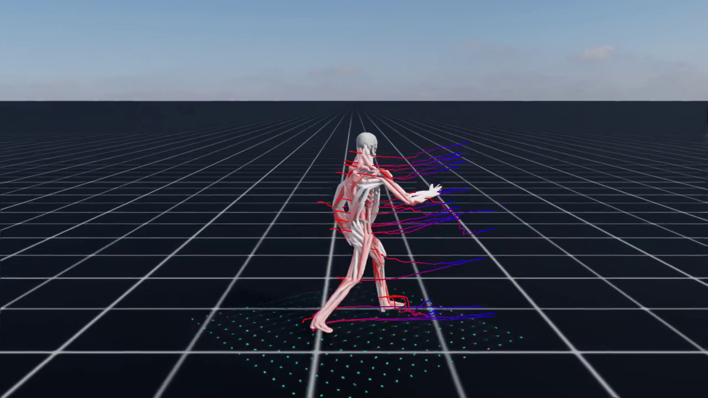
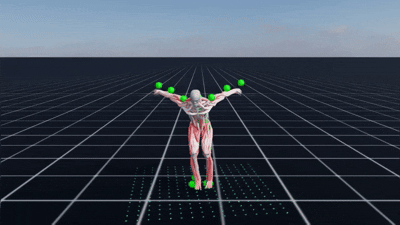
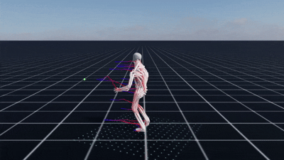

# MuscleControl-Isaac

An IsaacLab-based repository for **muscle-activation control** and **muscle/skeleton visualization**. This project extends the IsaacLab ecosystem with muscle-driven human models and training/evaluation pipelines for research in biomechanical control, imitation learning, and motion generation.(Full code coming soon.)

## Highlights
- Muscle-activation control: muscle-driven human models and control interfaces.
- Visualization: muscle and skeleton mesh rendering for analysis and debugging.
- Training & evaluation: integrated scripts and entry points for experiments.
- IsaacLab compatibility: designed to plug into existing IsaacLab workflows.

## Demos
MotionTracking

GenerativeMotion(DiffusionForcing)

## Acknowledgements
Built on IsaacLab and ProtoMotions. Thanks to the community and upstream dependencies.
