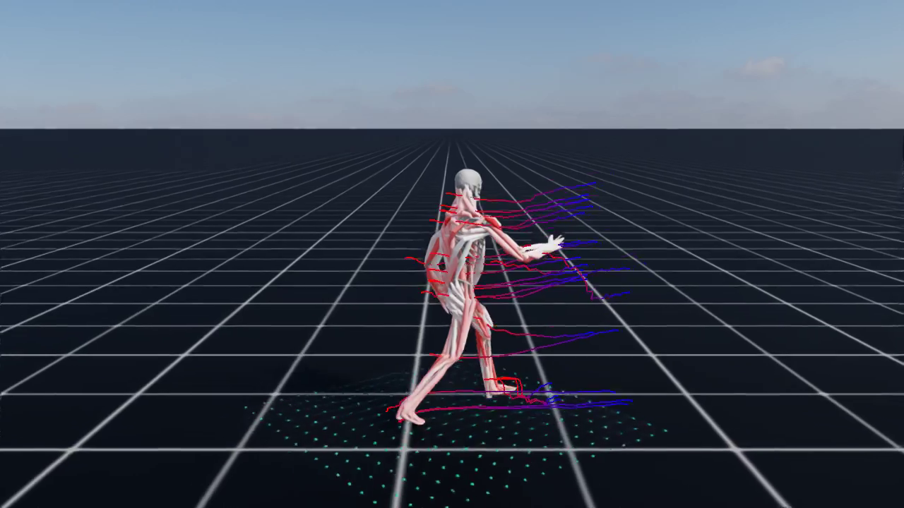
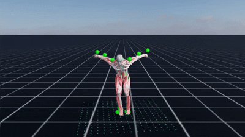
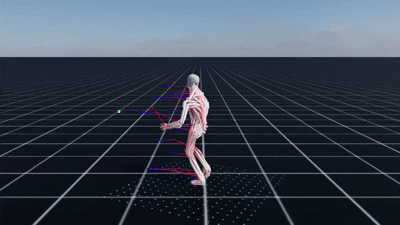

# MuscleControl-Isaac
An IsaacLab-based repository for **muscle-activation control** and **muscle/skeleton visualization**. This project extends the IsaacLab ecosystem with muscle-driven human models and training/evaluation pipelines for research in biomechanical control, imitation learning, and motion generation.



## Highlights
- Muscle-activation control: muscle-driven human models and control interfaces.
- Visualization: muscle and skeleton mesh rendering for analysis and debugging.
- Training & evaluation: integrated scripts and entry points for experiments.
- DiffusionForcing Control: use diffusion forcing to guide and control.
## Install
1. Install IsaacLab
2. Once IsaacLab is installed, from the repository root install the ProtoMotions package and its dependencies with:

Set PYTHON_PATH to point at the isaaclab.sh script
For Linux: 
```
alias PYTHON_PATH="<isaac_lab_path> -p"
```
For example: 
```
alias PYTHON_PATH="/home/USERNAME/IsaacLab/isaaclab.sh -p"
```
Once IsaacLab is installed, from the protomotions repository root, install the Physical Animation package and its dependencies with:
```
PYTHON_PATH -m pip install -e .
PYTHON_PATH -m pip install -r requirements_isaaclab.txt
PYTHON_PATH -m pip install -e isaac_utils
PYTHON_PATH -m pip install -e poselib
```

## Training
### PD(phase 1) 
```
CUDA_VISIBLE_DEVICES=0 python protomotions/train_agent.py \
    +exp=full_body_tracker/transformer_flat_terrain \
    +robot=bio_act \
    +simulator=isaaclab \
    motion_file=./data/amass_retarget.pt \
    +experiment_name=full_body_tracker_motionfix_v2 \
    num_envs=1024 \
    agent.config.batch_size=4096 \
    agent.config.num_mini_epochs=2 \
    agent.config.eval_metrics_every=2000 \
    +opt=wandb \
    wandb.wandb_id=${WANDB_ID:-null} \
    wandb.wandb_resume=allow \
    +agent.config.train_teacher=true \
    ngpu=1
```
### Muscle(phase 2)
```
CUDA_VISIBLE_DEVICES=0 python protomotions/train_agent.py \
    +exp=mus/no_vae_no_text_flat_terrain \
    +robot=bio_act_stu \
    +simulator=isaaclab \
    motion_file=./data/amass_filtered.pt \
    +experiment_name=student_2 \
    num_envs=1024 \
    agent.config.batch_size=2048 \
    agent.config.num_mini_epochs=2 \
    agent.config.eval_metrics_every=2000 \
    +opt=wandb \
    wandb.wandb_id=${WANDB_ID:-null} \
    wandb.wandb_resume=allow \
    agent.config.expert_model_path=results/full_body_tracker_motionfix_v2 \
    ngpu=1
```

## Demos
### MotionTracking


### GenerativeMotion(DiffusionForcing)



## Acknowledgements
Built on IsaacLab and ProtoMotions. Thanks to the community and upstream dependencies.
